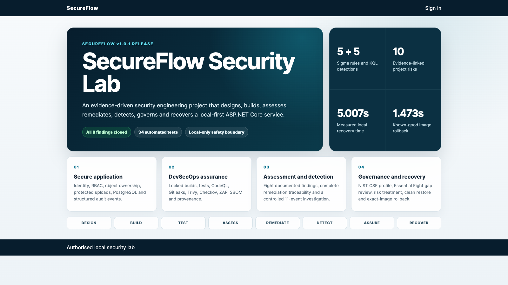
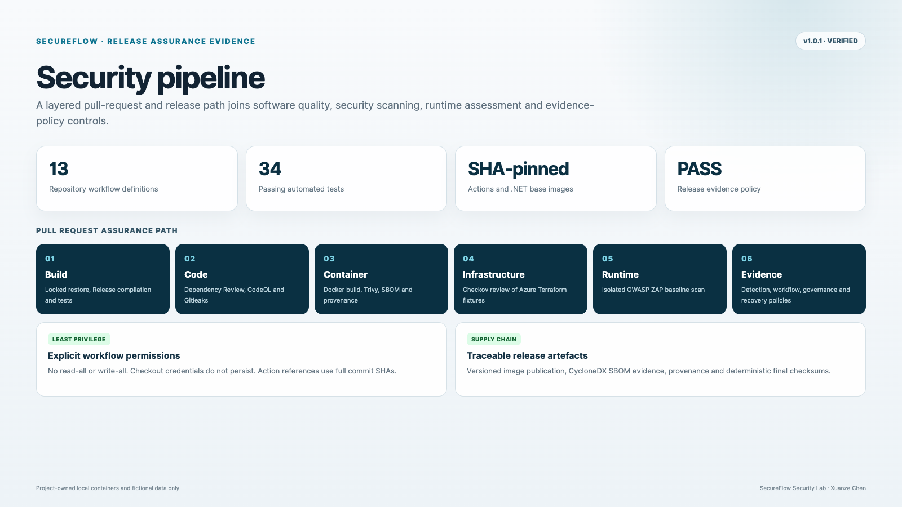
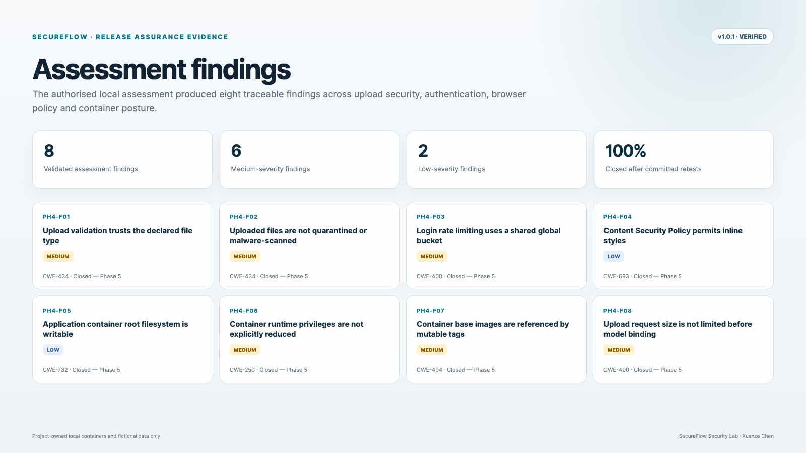
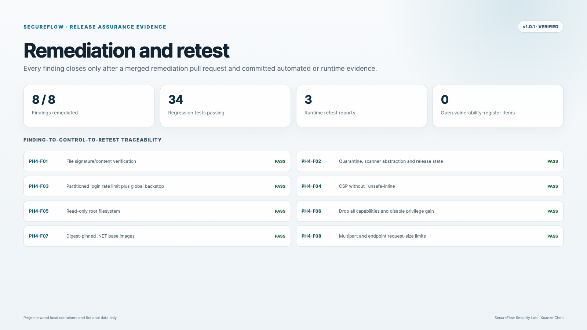
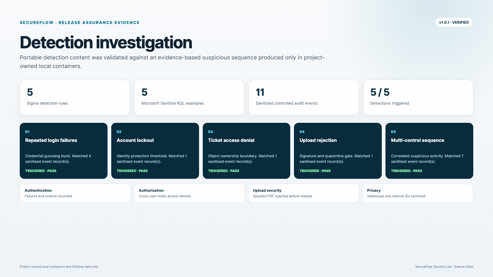
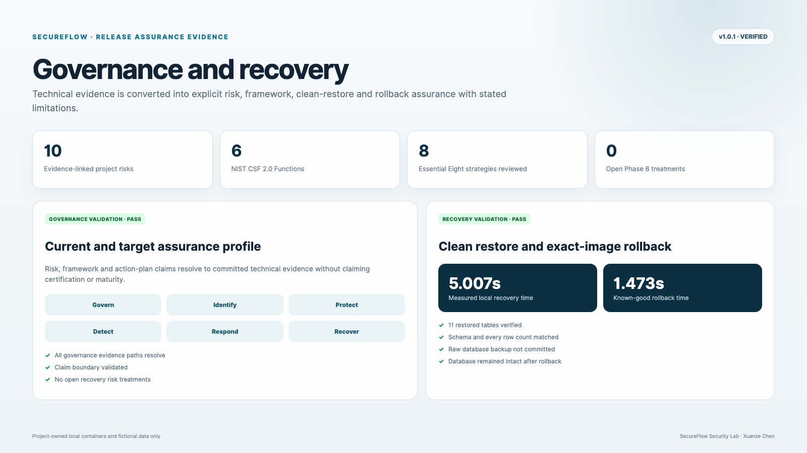

# SecureFlow Security Lab

A local-first security engineering reference implementation covering secure application
development, DevSecOps, authorised assessment, remediation, detection,
governance and recovery.

**Status: v1.0.1 — maintained release**

## Project overview

- Built an ASP.NET Core 10 and PostgreSQL 17 service with identity, RBAC,
  server-side object ownership, protected uploads and structured audit events.
- Automated Build, 34 tests, Docker, Dependency Review, CodeQL, Gitleaks,
  Trivy, Checkov, OWASP ZAP, SBOM, provenance and evidence-policy checks.
- Documented 8 assessment findings and closed all 8 through remediation and
  committed retests.
- Added 5 Sigma rules, 5 KQL examples and a controlled 11-event investigation
  in which all 5 detections triggered.
- Assessed 10 project risks across all 6 NIST CSF Functions and all 8 Essential
  Eight strategies, with no open Phase 6 recovery treatments.
- Verified a clean 11-table PostgreSQL restore in 5.007 seconds and exact-image
  rollback in 1.473 seconds.

## Release evidence













## Capability and evidence map

| Capability | Demonstrated evidence |
|---|---|
| Secure software development | ASP.NET Core Identity, RBAC, object ownership, upload quarantine and 34 tests |
| DevSecOps | Locked restore, CodeQL, Gitleaks, Trivy, Checkov, ZAP, SBOM and provenance |
| Application security | Authorised assessment, 8 findings, vulnerability register and retests |
| Vulnerability management | Finding-to-Issue-to-remediation-to-retest traceability |
| Detection engineering | 5 Sigma rules, 5 KQL examples and automated content validation |
| Incident response | Controlled 11-event investigation with sanitised evidence |
| Governance | 10-risk register, NIST CSF profile and Essential Eight gap review |
| Recovery | Validated backup, clean restore, integrity checks and exact-image rollback |

## Release reports

- [Management report](reports/FINAL_MANAGEMENT_REPORT.md)
- [Technical report](reports/FINAL_TECHNICAL_REPORT.md)
- [Final validation](docs/FINAL_VALIDATION.md)
- [Release evidence index](evidence/final/README.md)

## Delivery lifecycle

**Design → Build → Test → Assess → Remediate → Detect → Assure → Recover**

| Phase | Focus |
|---|---|
| Phase 1 | Security design and repository governance |
| Phase 2 | Secure application foundation |
| Phase 3 | DevSecOps automation and supply-chain assurance |
| Phase 4 | Authorised security assessment |
| Phase 5 | Remediation, detection engineering and incident investigation |
| Phase 6 | Governance, recovery and final reporting |

## Repository map

- `src/` — ASP.NET Core application
- `tests/` — application and security regression tests
- `.github/workflows/` — DevSecOps and evidence-policy automation
- `security-assessment/` — rules, findings, assessment and retests
- `detections/` — Sigma and KQL
- `incident-response/` — controlled investigation
- `governance/` — risk and framework evidence
- `recovery/` — backup, restore and rollback
- `reports/` — final management and technical reports
- `evidence/final/` — deterministic final evidence images and manifest

## Local start

```bash
./scripts/generate-local-secrets.sh
docker compose --env-file .env -f infrastructure/docker/compose.yml up --build
```

Open `http://localhost:8080`.

The script creates local-only fictional accounts. No passwords are committed.

## Safety and claim boundary

All testing is restricted to project-owned local containers and deliberately
created fictional data. No public or third-party target is in scope.

The project does not claim NIST certification, Essential Eight maturity,
organisational compliance, production cloud deployment, MFA, federation or a
production recovery SLA.

## Author

Xuanze Chen
