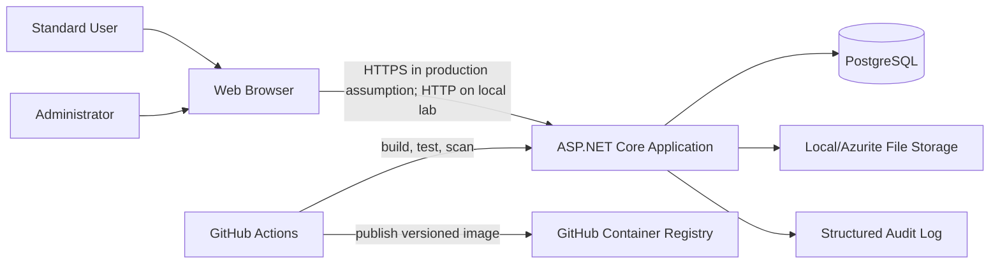

# Architecture

## Local-first target architecture

## Trust boundaries

1. Browser to application boundary
2. Application to database boundary
3. Application to file-storage boundary
4. Developer workstation to GitHub boundary
5. GitHub Actions runner to package and container registries

## Security design principles

- Deny access by default
- Enforce authorisation on the server
- Validate untrusted input at trust boundaries
- Do not store long-lived secrets in the repository
- Use least-privilege workflow permissions
- Generate auditable security events
- Keep the local runtime reproducible with Docker Compose
- Separate deliberately insecure test fixtures from the secure application

## Environment model

| Environment | Purpose | Data |
|---|---|---|
| Local development | Build and debug | Generated test data |
| Local assessment | Burp, ZAP, Nmap and manual testing | Resettable seeded data |
| GitHub Actions | Build, tests and scanners | Ephemeral fixtures |
| GHCR release | Versioned container evidence | No embedded secrets |
