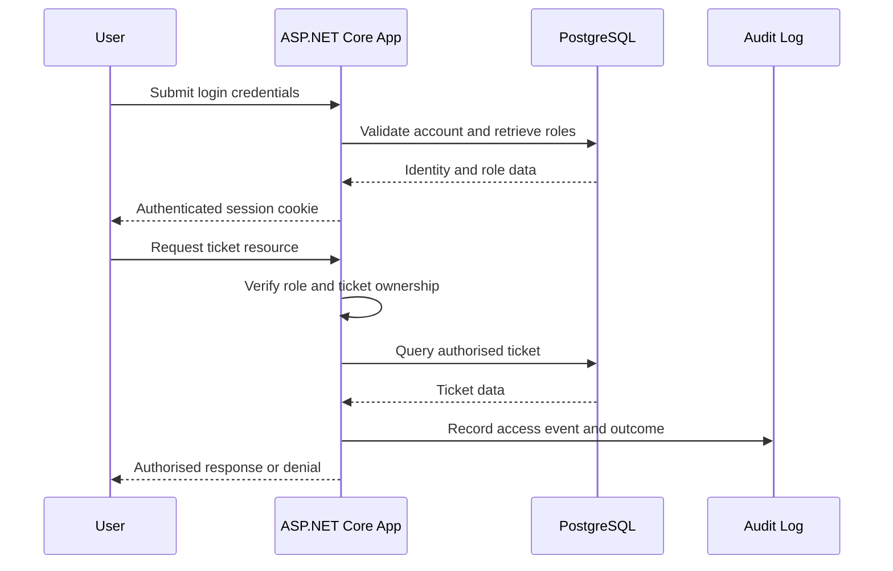

# Data Flow

## Primary user flow

## Sensitive data classes

| Data | Classification | Required handling |
|---|---|---|
| Password hash | Restricted | Never logged or exported |
| Authentication cookie | Restricted | HttpOnly, Secure assumption, SameSite |
| Ticket content | Internal | Object-level authorisation |
| Uploaded file | Internal | Type, size and storage validation |
| Audit record | Internal security | Integrity, timestamp and correlation ID |
| Test accounts | Synthetic | Clearly identified as non-production |

## Logging rules

Security logs may record user identifiers, action names, resource identifiers, outcome, source address and correlation ID. They must not record passwords, raw session cookies, access tokens or full uploaded-file contents.
